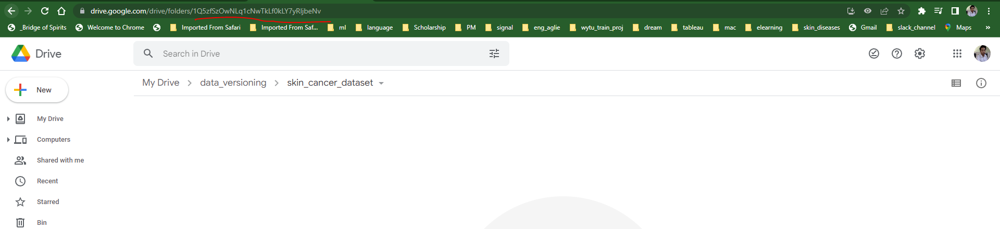

## Data and model versioning with DVC

### Getting start with DVC

##### 1. Installation

```bash
pip install dvc

dvc init
```


Remark : dvc can only start under git directory.

##### 2. Check dvc records are created or not.

```bash
git status
```

##### 3. Commit first commit.

```bash
git commit -m "first dvc"

git push
```

##### 3. Add data to dvc

```bash
dvc add 2_data_and_model_versioning\skin_cancer_dataset\Benign_keratosis-like_lesions\

dvc add 2_data_and_model_versioning\skin_cancer_dataset\Melanocytic_nevi\

dvc add 2_data_and_model_versioning\skin_cancer_dataset\Melanoma\
```

##### Now check the following:

```bash
cat 2_data_and_model_versioning\.gitignore
cat 2_data_and_model_versioning\skin_cancer_dataset\Benign_keratosis-like_lesions.dvc
cat 2_data_and_model_versioning\skin_cancer_dataset\Melanoma.dvc
```

##### Remark : Now we need to do step-3 and step-2 in every data change.


### DVC with Remote Storage 

1. ##### Create folder and get the google folder ID as shown in figure:

   eg : **1Q5zfSzOwNLq1cNwTkLf0kLY7yRljbeNv** in my example




2. #####  set this folder as default remote location for DVC

   ```bash
   dvc remote add -d storage gdrive://1Q5zfSzOwNLq1cNwTkLf0kLY7yRljbeNv
   ```

3. ##### update this in git.

   ```bash
   git commit -m "set gdrive in dvc"
   ```

4. ##### upload your data to gdrive

   ```bash
   dvc push
   ```

   
