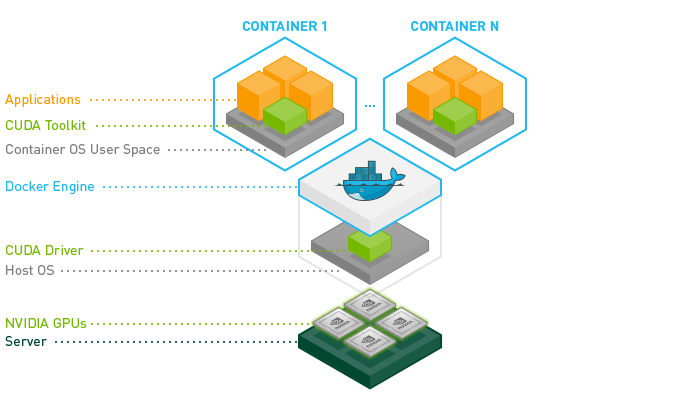

## Containerized application and gpu mount.




###### Check CUDA installation Path

```bash
ls -l /usr/local | grep cuda
```

###### check CUDA usage

```bash
nvidia-smi
```

###### List docker images

```bash
docker images
```

###### Build image

```bash
docker build . -t "nvidia"
```

###### Run image

```
docker run --gpus all -it --rm -p 5002:5002 IMAGE_ID
```


###### Some useful GPU images

```dockerfile
FROM pytorch/pytorch:1.7.0-cuda11.0-cudnn8-devel
FROM nvidia/cuda:11.0.3-runtime-ubuntu20.04
FROM nvcr.io/nvidia/pytorch:20.11-py3
FROM nvidia/cuda:11.3.0-base-ubuntu20.04
FROM nvcr.io/nvidia/pytorch:20.11-py3
```

##### Reference

- [Nvidia Containers](https://catalog.ngc.nvidia.com/orgs/nvidia/containers/pytorch)
- [Nvidia Docker Hubs](https://hub.docker.com/r/nvidia/cuda)
- [Nvidia-docker github](https://github.com/NVIDIA/nvidia-docker)
- [nlp.stanford.edu](https://nlp.stanford.edu/mistral/tutorials/gcp_plus_kubernetes.html)
